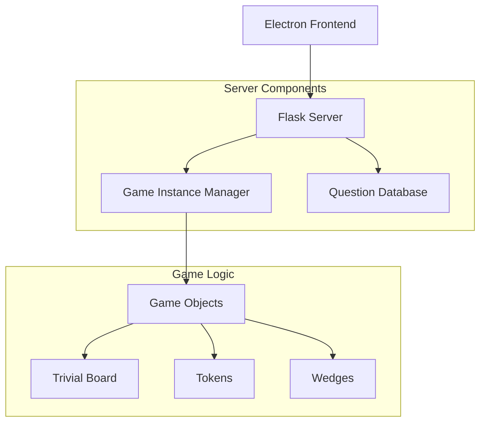
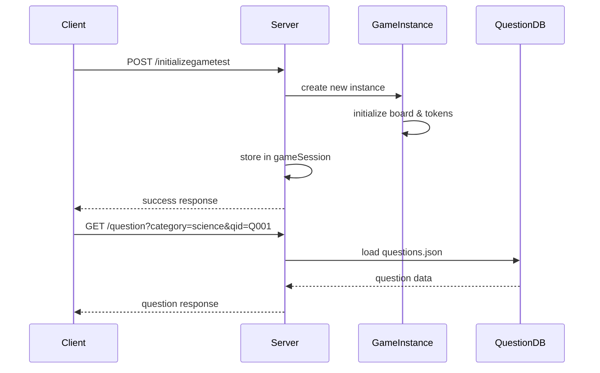
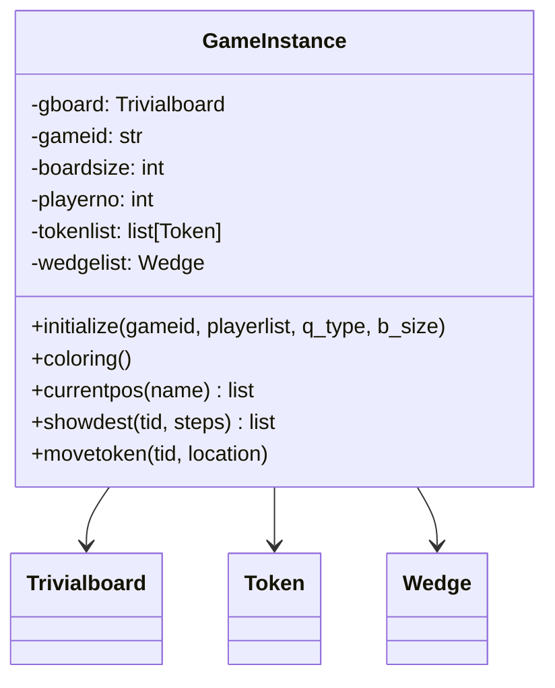
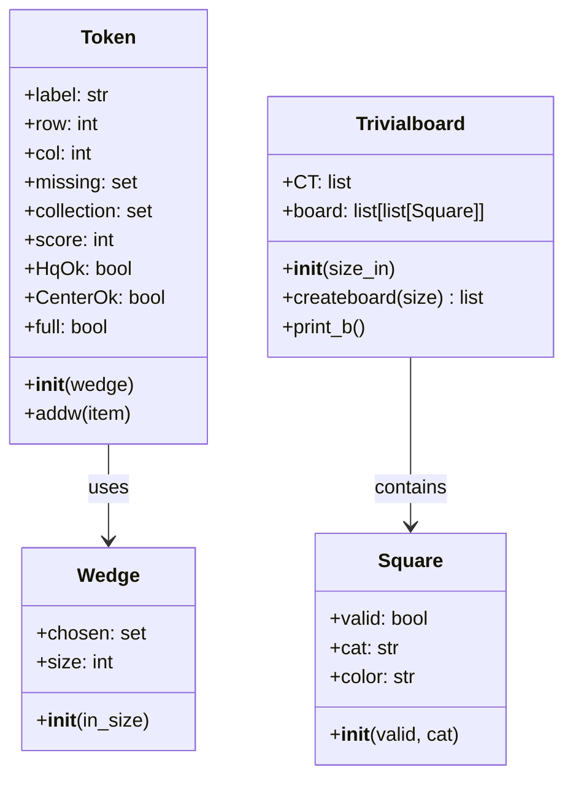
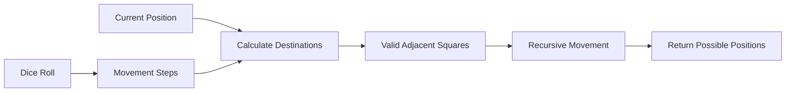
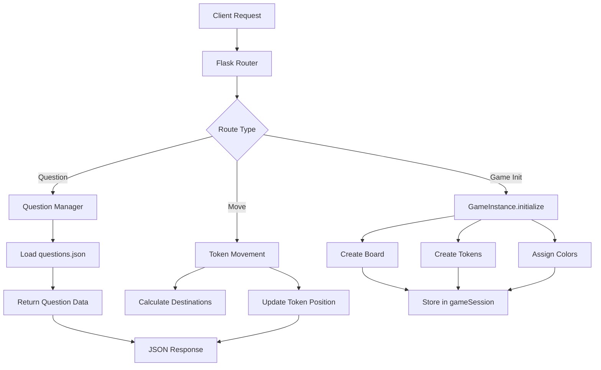
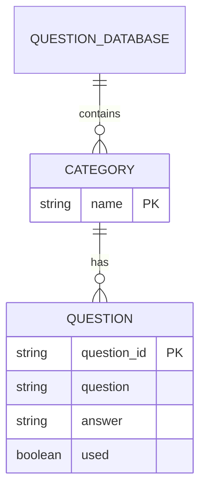
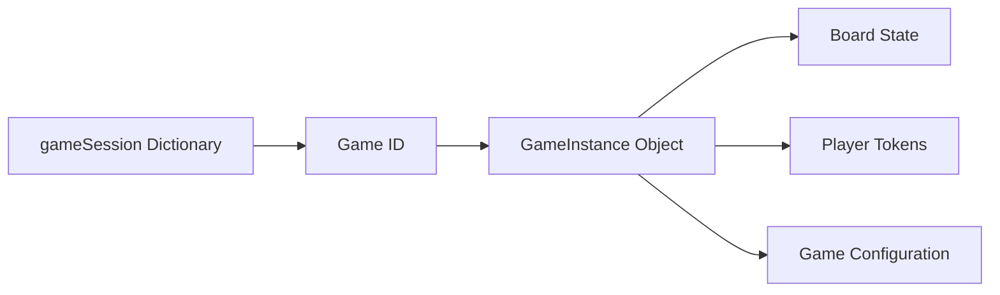
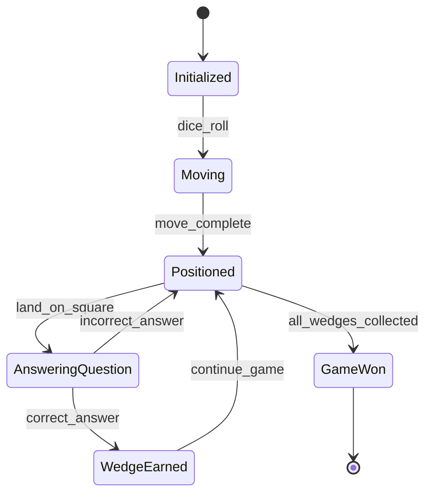
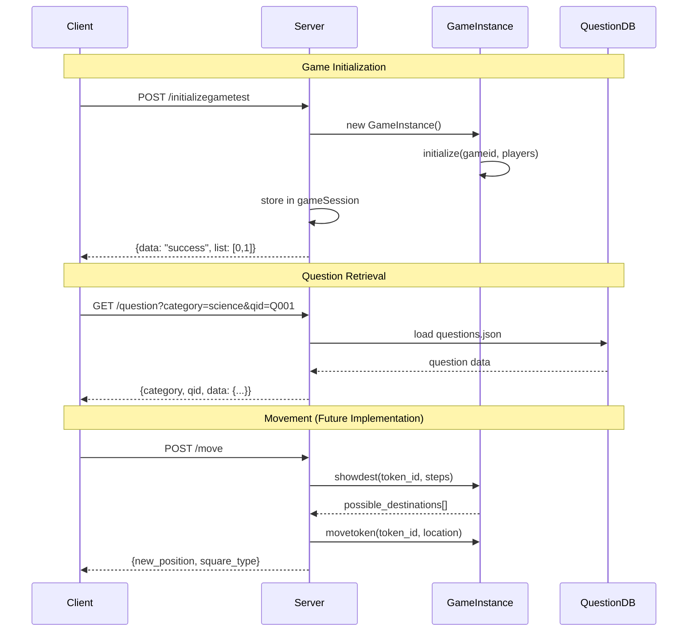

# CSYGC Trivial Compute - Server Design Document

## Overview

The CSYGC Trivial Compute server is a Python-based Flask web server that manages a trivia board game similar to Trivial Pursuit. The server handles game instances, player management, board state, question serving, and game logic through a RESTful API.

## Architecture Overview



## System Components

### 1. Server Module (`server.py`)

**Purpose**: Main Flask application server that handles HTTP requests and manages game sessions.

**Key Responsibilities**:
- HTTP API endpoint management
- CORS configuration for cross-origin requests
- Game session storage and management
- Question database interaction
- Logging and debugging

**API Endpoints**:
- `POST /rule` - Test endpoint returning basic message
- `GET /question` - Retrieve specific question by category and ID
- `POST /init_questions` - Initialize and return all available questions
- `POST /initializegametest` - Create new game instance



### 2. Game Instance Module (`gameinstance.py`)

**Purpose**: Main game controller that manages individual game sessions.

**Key Components**:
- Game board creation and management
- Player token initialization
- Board coloring assignment
- Token movement and positioning



### 3. Game Objects Module (`gameobject.py`)

**Purpose**: Core game entities and their behaviors.

#### Class Hierarchy



#### Board Layout

The game board is a 9x9 grid with special squares:

```
     0   1   2   3   4   5   6   7   8   
  0 [RA][NL][NL][NL][HQ][NL][NL][NL][RA]
  1 [NL][  ][  ][  ][NL][  ][  ][  ][NL]
  2 [NL][  ][  ][  ][NL][  ][  ][  ][NL]
  3 [NL][  ][  ][  ][NL][  ][  ][  ][NL]
  4 [HQ][NL][NL][NL][CT][NL][NL][NL][HQ]
  5 [NL][  ][  ][  ][NL][  ][  ][  ][NL]
  6 [NL][  ][  ][  ][NL][  ][  ][  ][NL]
  7 [NL][  ][  ][  ][NL][  ][  ][  ][NL]
  8 [RA][NL][NL][NL][HQ][NL][NL][NL][RA]
```

**Square Types**:
- `CT`: Center (starting position)
- `HQ`: Headquarters (special squares for each color)
- `RA`: Roll Again squares
- `NL`: Normal colored squares
- `IV`: Invalid squares (empty spaces)

### 4. Game Helper Functions (`gamehelperfunct.py`)

**Purpose**: Utility functions for game mechanics.

**Functions**:
- `rolldice(x=1)`: Simulates dice rolling
- `destination(row, col, steps, board)`: Calculates possible moves
- `printlist(plist)`: Debug utility for board printing



## Data Flow Architecture



## Question Management System

The server manages a JSON-based question database with the following structure:

```json
{
  "category": {
    "question_id": {
      "question": "Question text",
      "answer": "Answer text",
      "used": false
    }
  }
}
```

**Categories**: science, history, sports, entertainment, geography, etc.



## Game State Management

### Session Storage



### Token State Tracking



## API Design

### Request/Response Flow



## Error Handling and Logging

The server implements comprehensive logging and error handling:

```python
logging.basicConfig(
    level=logging.DEBUG,
    format='[%(asctime)s] %(levelname)s  %(message)s'
)
```

**Error Scenarios**:
- Missing question parameters
- Question not found
- Game initialization failures
- Invalid move requests

## Performance Considerations

### Memory Management
- Game sessions stored in memory dictionary
- Question database loaded per request (could be optimized)
- Board state maintained efficiently with 2D arrays

### Scalability
- Current implementation supports single-server deployment
- Session storage in memory limits horizontal scaling
- Future improvements could include:
  - Database-backed session storage
  - Redis for session management
  - Stateless API design

## Security Considerations

### Current Implementation
- CORS enabled for cross-origin requests
- No authentication/authorization implemented
- No input validation on API endpoints

### Recommendations
- Add input validation and sanitization
- Implement rate limiting
- Add authentication for game sessions
- Validate game state transitions

## Deployment Architecture

```mermaid
graph TB
    A[Electron App] --> B[Embedded Flask Server]
    B --> C[Local File System]
    C --> D[questions.json]
    C --> E[Python Modules]
    
    subgraph "Local Deployment"
        B
        C
        D
        E
    end
    
    F[Process Manager] --> B
    F --> G[Port: 5000 (configurable)]
```

## Future Enhancements

### Planned Features
1. **Complete Movement API**: Full implementation of token movement endpoints
2. **Game Rules Engine**: Answer validation and wedge collection logic
3. **Real-time Updates**: WebSocket support for multi-player synchronization
4. **Persistence**: Database integration for game state persistence
5. **Admin Interface**: Game management and question database administration

### Technical Debt
1. **Error Handling**: Improve comprehensive error handling across all modules
2. **Input Validation**: Add request validation and sanitization
3. **Testing**: Implement unit and integration tests
4. **Documentation**: Add inline code documentation and API specs
5. **Configuration**: Externalize configuration settings

## Conclusion

The CSYGC Trivial Compute server provides a solid foundation for a trivia board game with a clean separation of concerns between web serving, game logic, and data management. The modular design allows for easy extension and maintenance while the Flask framework provides a reliable web server foundation.

The current implementation focuses on core game mechanics and basic API endpoints, with room for enhancement in areas such as real-time communication, persistence, and advanced game features.